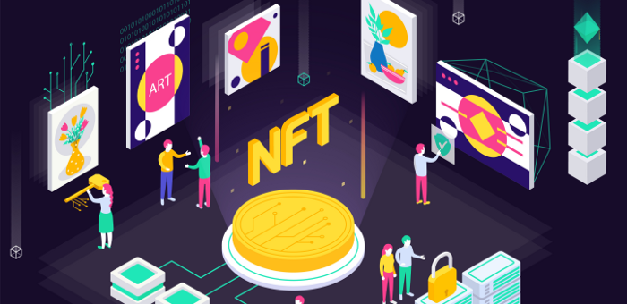

<div align="center">
  <a href="https://particle.network/">
    
  </a>
  <h3>
    Solana NFT Market Demo <br /><a href="https://docs.particle.network/nft-service/introduction">View documentation</a>
  </h3>
</div>


Demo of a Solana NFT Marketplace based on [Metaplex protocol](https://docs.metaplex.com/) and powered by [Particle Network Service](https://docs.particle.network/)

## ⚡️ Live
See it live on [https://web-nft-demo.particle.network](https://web-nft-demo.particle.network)

## 🔬 Functionalities
</img>

- Initialize Market
- Query blockchain for NFT owner and metadata.
- Minting NFT
- Uploading NFT image to IPFS
- Updating NFT metadata
- **Sell NFT**
- **Buy NFT**
- **Settle && Withdraw**

## 🔧 Quick Start

💿 git clone the project and install the dependencies

```bash
git clone git@github.com:Particle-Network/particle-solana-nft-web-demo.git
cd particle-solana-nft-web-demo
yarn install
```

✏ Set your Particle Network configuration in **.env**. If you don't have a Particle Network account, please register on the [Particle Network Dashboard](https://dashboard.particle.network/), then create a project and an app.

```bash
NEXT_PUBLIC_PROJECT_ID='Your Particle Network project id'
NEXT_PUBLIC_PROJECT_CLIENT_KEY='The client key of your project'
NEXT_PUBLIC_PROJECT_APP_ID='The app id of your project'
```

🚴‍♂️ Finally, start the project.

```bash
yarn start
```

## ⚠️ Notice

The demo uses `IndexedDB` to store centralized data, and if the associated database is deleted, the auction-related data will be lost. So we Strongly recommended running this demo by the `devnet` network.

Switching networks cleans up local db, which means that transaction-related data is lost.

## 💼 Feedback

If you got some problems, please report bugs or issues.

You can also join our [Discord](https://discord.gg/2y44qr6CR2).

